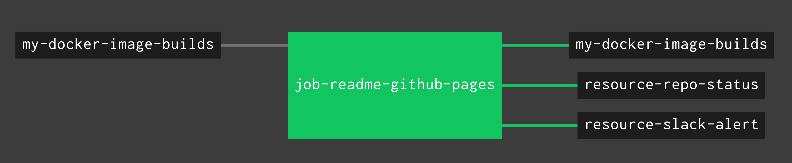

# my-vagrant-boxes

[](https://codeclimate.com/github/JeffDeCola/my-docker-image-builds/maintainability)
[](https://codeclimate.com/github/JeffDeCola/my-docker-image-builds/issues)
[](http://jeffdecola.mit-license.org)

`my-vagrant-boxes` _is a place for me to use vagrant boxes and create vagrant boxes._

`my-vagrant-boxes`
[GitHub Webpage](https://jeffdecola.github.io/my-docker-image-builds/).

## DOCKER BUILDS LIST

* `gcloud-kubectl`
  The
  [Dockerfile](https://github.com/JeffDeCola/my-docker-image-builds/blob/master/gcloud-kubectl/Dockerfile)
  creates the
  [docker Image](https://hub.docker.com/r/jeffdecola/gcloud-kubectl)
  with at least these versions,
  * ubuntu 18.04
  * gcloud SDK 241.0.0
    * Installed kubectl component
  * kubectl 1.14

* `go-gcloud-packer`
  The
  [Dockerfile](https://github.com/JeffDeCola/my-docker-image-builds/blob/master/go-gcloud-packer/Dockerfile)
  creates the
  [docker Image](https://hub.docker.com/r/jeffdecola/go-gcloud-packer)
  with at least these versions,
  * ubuntu 18.04
  * go 1.11
    * Installed package "google.golang.org/appengine"
  * gcloud SDK 240.0.0
    * Installed google app engine go extension component
  * packer 1.3.5
d
## RUN CONTAINER & GET BASH SHELL

To run a docker container.

```bash
docker run --name go-gcloud-packer -dit jeffdecola/go-gcloud-packer
```

To get a bash shell inside a running container,

```bash
docker exec -i -t go-gcloud-packer /bin/bash
```

## UPDATE GITHUB WEBPAGE USING CONCOURSE (OPTIONAL)

For fun, I use concourse to update
[my-docker-image-builds GitHub Webpage](https://jeffdecola.github.io/my-docker-image-builds/)
and alert me of the changes via repo status and slack.

A pipeline file [pipeline.yml](https://github.com/JeffDeCola/my-docker-image-builds/tree/master/ci/pipeline.yml)
shows the entire ci flow. Visually, it looks like,



The `jobs` and `tasks` are,

* `job-readme-github-pages` runs task
  [readme-github-pages.sh](https://github.com/JeffDeCola/my-docker-image-builds/tree/master/ci/scripts/readme-github-pages.sh).

The concourse `resources types` are,

* `my-docker-image-builds` uses a resource type
  [docker-image](https://hub.docker.com/r/concourse/git-resource/)
  to PULL a repo from github.
* `resource-slack-alert` uses a resource type
  [docker image](https://hub.docker.com/r/cfcommunity/slack-notification-resource)
  that will notify slack on your progress.
* `resource-repo-status` uses a resource type
  [docker image](https://hub.docker.com/r/dpb587/github-status-resource)
  that will update your git status for that particular commit.

For more information on using concourse for continuous integration,
refer to my cheat sheet on [concourse](https://github.com/JeffDeCola/my-cheat-sheets/tree/master/software/operations-tools/continuous-integration-continuous-deployment/concourse-cheat-sheet).
