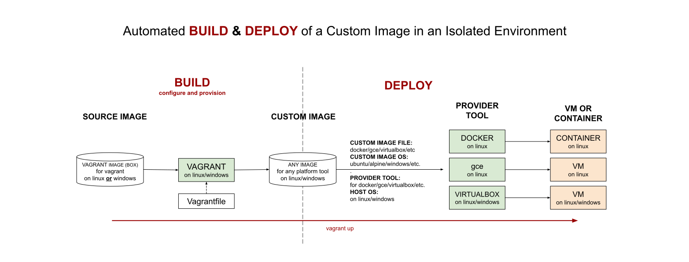

# MY VAGRANT BOXES

[](https://jeffdecola.com)
[](https://jeffdecola.mit-license.org)

_A place to keep my vagrant images (boxes)._

tl;dr

```bash
# BUILD & DEPLOY VAGRANT IMAGE (BOX)
vagrant up

## CONNECT
vagrant ssh
vagrant ssh-config
ssh -i ~/.vagrant.d/insecure_private_key -p 2222 vagrant@{IP}

# OTHER COMMANDS
vagrant box list
vagrant box add --name {VAGRANT IMAGE (BOX) NAME} --force ubuntu-box.box
vagrant box add --insecure {VAGRANT IMAGE (BOX) NAME}--insecure
vagrant box remove {VAGRANT IMAGE (BOX) NAME}
```

Table of Contents

* [OVERVIEW](https://github.com/JeffDeCola/my-vagrant-boxes#overview)
* [DOCKER](https://github.com/JeffDeCola/my-vagrant-boxes#docker)
* [VIRTUALBOX](https://github.com/JeffDeCola/my-vagrant-boxes#virtualbox)

Documentation and Reference

* [vagrant](https://github.com/JeffDeCola/my-cheat-sheets/tree/master/software/development/development-environments/vagrant-cheat-sheet)
* [vagrant box search](https://app.vagrantup.com/boxes/search)
* an illustration of how
  [vagrant, docker and packer](https://github.com/JeffDeCola/my-cheat-sheets/tree/master/software/operations/orchestration/builds-deployment-containers/packer-cheat-sheet#vagrant-docker-and-packer)
  build and deploy images
* [vagrant-remove-images.sh](https://github.com/JeffDeCola/my-linux-shell-scripts/tree/master/vagrant/vagrant-remove-images)
* This repos
  [github webpage](https://jeffdecola.github.io/my-vagrant-boxes/)
  _built with
  [concourse](https://github.com/JeffDeCola/my-vagrant-boxes/blob/master/ci-README.md)_

## OVERVIEW

Vagrant is useful for the automated **BUILD** and **DEPLOY** of a custom image.
This is useful for easily launching a common custom design environment
for a project because you only need a Vagrantfile.



These builds and deploys use the following statement,

**Using vagrant to build a/an {CUSTOM IMAGE FILE} image
containing the {CUSTOM IMAGE OS} OS
to deploy on {PROVIDER TOOL} on {HOST OS}.**

Where,

* **CUSTOM IMAGE FILE**: docker/gce/virtualbox/etc.
* **CUSTOM IMAGE OS**: ubuntu/alpine/windows/etc.
* **PROVIDER TOOL**: docker/gce/virtualbox/etc.
* **HOST OS**: linux/windows _(not needed)_

## DOCKER

_I'm not sure anyone would use this since you can just use docker._

* [vagrant-ubuntu-2004-deploy-docker](https://github.com/JeffDeCola/my-vagrant-boxes/tree/master/docker/vagrant-ubuntu-2004-deploy-docker)

  _Using vagrant to build a docker image
  containing the ubuntu 20.04 OS
  to deploy on docker._

## VIRTUALBOX

_You may run this on linux or windows._

* [vagrant-ubuntu-2204-deploy-virtualbox](https://github.com/JeffDeCola/my-vagrant-boxes/tree/master/virtualbox/vagrant-ubuntu-2204-deploy-virtualbox)

  _Using vagrant to build a virtualbox image
  containing the ubuntu 22.04 OS
  to deploy on virtualbox._

* [vagrant-windows-11-deploy-virtualbox](https://github.com/JeffDeCola/my-vagrant-boxes/tree/master/virtualbox/vagrant-windows-11-deploy-virtualbox)

  _Using vagrant to build a virtualbox image
  containing the windows 11 OS
  to deploy on virtualbox._
