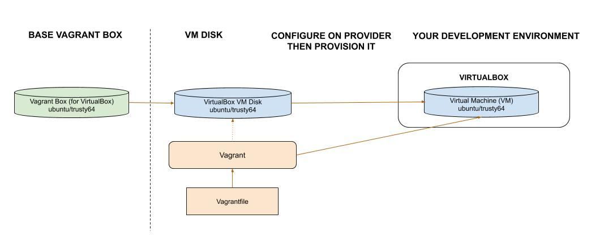

# my-vagrant-boxes

[](https://codeclimate.com/github/JeffDeCola/my-vagrant-boxes/maintainability)
[](https://codeclimate.com/github/JeffDeCola/my-vagrant-boxes/issues)
[](http://jeffdecola.mit-license.org)

`my-vagrant-boxes` _is a place for me to use vagrant boxes and create vagrant boxes.
The goal is to create a common development environment._

My
[vagrant cheat sheet](https://github.com/JeffDeCola/my-cheat-sheets/tree/master/software/development/development-environments/vagrant-cheat-sheet)
has a great illustration of the following boxes.

Search for vagrant boxes at
[vagrant box search](https://app.vagrantup.com/boxes/search).

[GitHub Webpage](https://jeffdecola.github.io/my-vagrant-boxes/).

## USE VAGRANT BOXES - FOR DOCKER

I'm not sure I'm sold on this since I could just easily make a docker image
using a Dockerfile.  So I'm not sure I see the real benefit of doing this.
But here it is anyway.

### ubuntu-1804-docker-container

* Development Environment Goal - Run ubuntu 18.04 in a docker container
* Using
  [tknerr/baseimage-ubuntu-18.04](https://app.vagrantup.com/tknerr/boxes/baseimage-ubuntu-18.04)
  Vagrant Box (for docker)
* [Vagrantfile](https://github.com/JeffDeCola/my-vagrant-boxes/blob/master/ubuntu-1804-docker-container/Vagrantfile)
  to manage/configure this development environment

To run enter directory,

```bash
vagrant up
```

To ssh onto running docker container,

```bash
docker exec -i -t jeffs-ubuntu-container /bin/bash
vagrant docker-exec -it -- /bin/sh
```

Here is an illustration,


## USE VAGRANT BOXES - FOR VIRTUALBOX (WINDOWS)

This is also nice if you have a lot of Virtual Machines and want to fire them up
on another machine.  I love configuration files.

### ubuntu-1604-virtualbox-vm

* Development Environment Goal - Run ubuntu 16.04 in a VirtualBox VM (WINDOWS)
* Using
  [ubuntu/xenial64](https://app.vagrantup.com/ubuntu/boxes/xenial64)
  Vagrant Box (for virtualbox)
* [Vagrantfile](https://github.com/JeffDeCola/my-vagrant-boxes/blob/master/ubuntu-1604-virtualbox-vm/Vagrantfile)
  to manage/configure this development environment

To run enter directory,

```bash
vagrant up
```

To ssh onto this VM,

```bash
vagrant ssh
```

A gui should also pop up.  User and Password is vagrant.

Here is an illustration,



## CREATE VAGRANT BOX (FOR VIRTUALBOX ON WINDOWS) USING PACKER

Packer is great at creating images, so lets create our own
custom vagrant box using packer.

### jeffs-ubuntu-1804-virtualbox-vm-box

We will use a base image and add `htop` to it.

I got this box creation from [serainville](https://github.com/serainville/packer_templates)
and very slightly modified it.


To run enter directory,

```bash
packer build vagrant-packer-template.json
```

Now we have the box is `/box/jeffs-ubuntu-1804-virtualbox-vm-box.box`.

Add to vagrant

```bash
vagrant add box --name "ubuntu/jeffs-ubuntu-1804-virtualbox-vm-box" --force jeffs-ubuntu-1804-virtualbox-vm-box.box
```

Now use the box like normal.

Here is an illustration,


## UPDATE GITHUB WEBPAGE USING CONCOURSE (OPTIONAL)

For fun, I use concourse to update
[my-vagrant-boxes GitHub Webpage](https://jeffdecola.github.io/my-vagrant-boxes/)
and alert me of the changes via repo status and slack.

A pipeline file [pipeline.yml](https://github.com/JeffDeCola/my-vagrant-boxes/tree/master/ci/pipeline.yml)
shows the entire ci flow. Visually, it looks like,


The `jobs` and `tasks` are,

* `job-readme-github-pages` runs task
  [readme-github-pages.sh](https://github.com/JeffDeCola/my-vagrant-boxes/tree/master/ci/scripts/readme-github-pages.sh).

The concourse `resources types` are,

* `my-vagrant-boxes` uses a resource type
  [docker-image](https://hub.docker.com/r/concourse/git-resource/)
  to PULL a repo from github.
* `resource-slack-alert` uses a resource type
  [docker image](https://hub.docker.com/r/cfcommunity/slack-notification-resource)
  that will notify slack on your progress.
* `resource-repo-status` uses a resource type
  [docker image](https://hub.docker.com/r/dpb587/github-status-resource)
  that will update your git status for that particular commit.

For more information on using concourse for continuous integration,
refer to my cheat sheet on [concourse](https://github.com/JeffDeCola/my-cheat-sheets/tree/master/software/operations-tools/continuous-integration-continuous-deployment/concourse-cheat-sheet).
