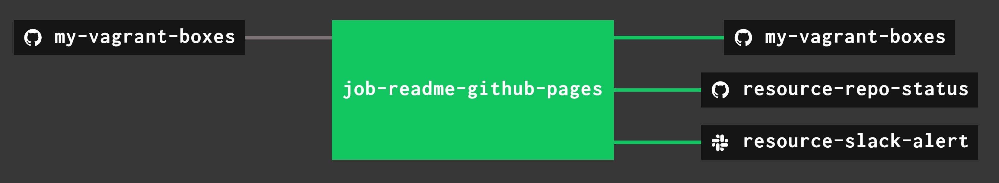

# my-vagrant-boxes

`my-vagrant-boxes` _is a place for me to use vagrant boxes and create vagrant boxes._

`my-vagrant-boxes`
[GitHub Webpage](https://jeffdecola.github.io/my-vagrant-boxes/).

## VAGRANT BOX LIST

## UPDATE GITHUB WEBPAGE USING CONCOURSE (OPTIONAL)

For fun, I use concourse to update
[my-vagrant-boxes GitHub Webpage](https://jeffdecola.github.io/my-vagrant-boxes/)
and alert me of the changes via repo status and slack.

A pipeline file [pipeline.yml](https://github.com/JeffDeCola/my-vagrant-boxes/tree/master/ci/pipeline.yml)
shows the entire ci flow. Visually, it looks like,

The `jobs` and `tasks` are,

* `job-readme-github-pages` runs task
  [readme-github-pages.sh](https://github.com/JeffDeCola/my-vagrant-boxes/tree/master/ci/scripts/readme-github-pages.sh).

The concourse `resources types` are,

* `my-vagrant-boxes` uses a resource type
  [docker-image](https://hub.docker.com/r/concourse/git-resource/)
  to PULL a repo from github.
* `resource-slack-alert` uses a resource type
  [docker image](https://hub.docker.com/r/cfcommunity/slack-notification-resource)
  that will notify slack on your progress.
* `resource-repo-status` uses a resource type
  [docker image](https://hub.docker.com/r/dpb587/github-status-resource)
  that will update your git status for that particular commit.

For more information on using concourse for continuous integration,
refer to my cheat sheet on [concourse](https://github.com/JeffDeCola/my-cheat-sheets/tree/master/software/operations-tools/continuous-integration-continuous-deployment/concourse-cheat-sheet).
