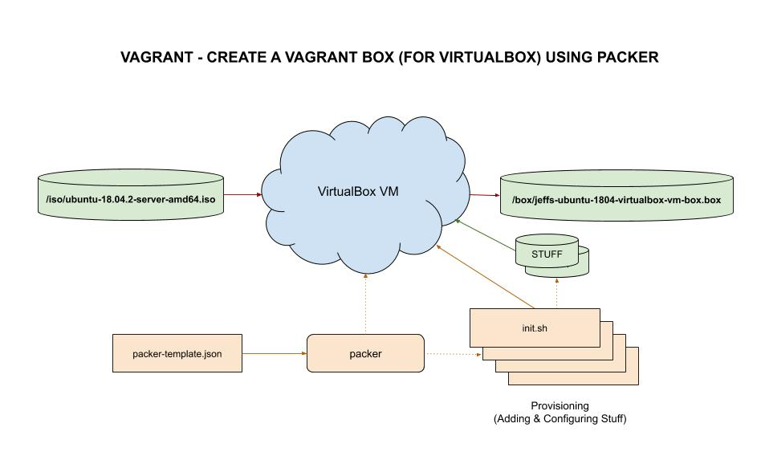

# jeffs-ubuntu-1804-virtualbox-vm-box

_Using packer to build a vagrant box of ubuntu 18.04._

## PACKER TEMPLATE FILE

The packer template file will build, configure and provision this
vagrant box of ubuntu 18.04 from a base image.

* [vagrant-packer-template.json](https://github.com/JeffDeCola/my-vagrant-boxes/blob/master/create-vagrant-box-for-virtualbox-on-windows-using-packer/jeffs-ubuntu-1804-virtualbox-vm-box/vagrant-packer-template.json)
* Resources for build
  * Using a `iso/ubuntu-18.04.2-server-amd64.iso` ubuntu 18.04 .iso file
* Configure and provision
  * [init.sh](https://github.com/JeffDeCola/my-vagrant-boxes/blob/master/create-vagrant-box-for-virtualbox-on-windows-using-packer/jeffs-ubuntu-1804-virtualbox-vm-box/install-scripts/init.sh)
  * [move-welcome-file.sh](https://github.com/JeffDeCola/my-vagrant-boxes/blob/master/create-vagrant-box-for-virtualbox-on-windows-using-packer/jeffs-ubuntu-1804-virtualbox-vm-box/install-scripts/move-welcome-file.sh)
  * [move-vagrant-insecure-public-key.sh](https://github.com/JeffDeCola/my-vagrant-boxes/blob/master/create-vagrant-box-for-virtualbox-on-windows-using-packer/jeffs-ubuntu-1804-virtualbox-vm-box/install-scripts/move-vagrant-insecure-public-key.sh)
  * [install-packages.sh](https://github.com/JeffDeCola/my-vagrant-boxes/blob/master/create-vagrant-box-for-virtualbox-on-windows-using-packer/jeffs-ubuntu-1804-virtualbox-vm-box/install-scripts/install-packages.sh)
  * [cleanup.sh](https://github.com/JeffDeCola/my-vagrant-boxes/blob/master/create-vagrant-box-for-virtualbox-on-windows-using-packer/jeffs-ubuntu-1804-virtualbox-vm-box/install-scripts/cleanup.sh)

I got this box creation from [serainville](https://github.com/serainville/packer_templates)
and very slightly modified it.

## BUILD

To build,

```bash
packer build vagrant-packer-template.json
```

Now we have the box in `/box/jeffs-ubuntu-1804-virtualbox-vm-box.box`.

## ADD/REMOVE FROM VAGRANT

Add/list/remove box to/from vagrant,

```bash
vagrant box add --name "ubuntu/jeffs-ubuntu-1804-virtualbox-vm-box" --force jeffs-ubuntu-1804-virtualbox-vm-box.box
vagrant box list
vagrant box remove ubuntu/jeffs-ubuntu-1804-virtualbox-vm-box
```

Use as normal (i.e. vagrant up).

## ILLUSTRATION

This may help,

